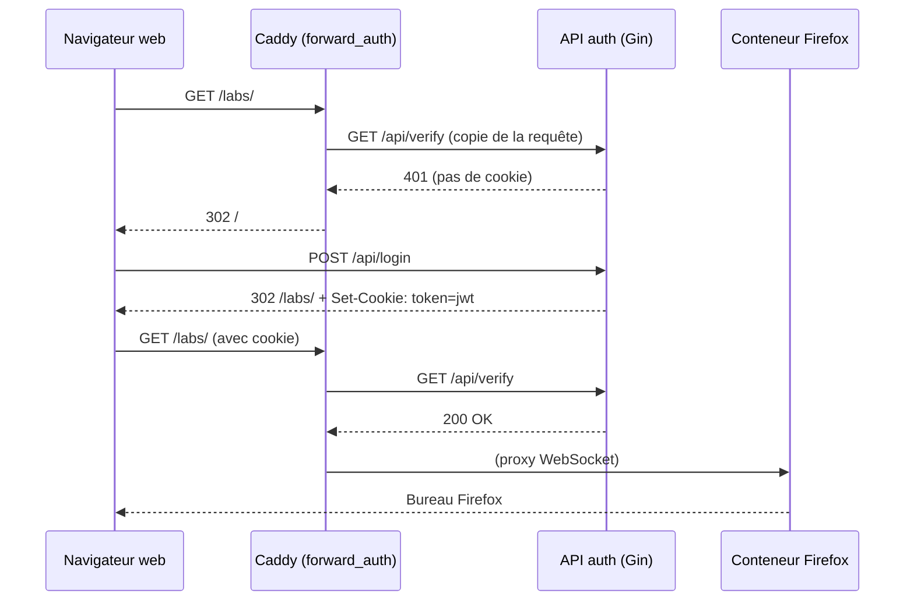

# 🦊 Firefox Remote GUI over Web (Docker + noVNC + Caddy)

Exécutez un navigateur **Firefox** dans un environnement graphique complet directement sur votre VPS ; accédez‑y ensuite depuis **n’importe quel navigateur web** — sans installer de client VNC natif.

---

## 📑 Sommaire

1. [Présentation](#présentation)
2. [Fonctionnalités principales](#fonctionnalités-principales)
3. [Définitions](#définitions)
4. [Contenu du dépôt](#contenu-du-dépôt)
5. [Démarrage rapide](#démarrage-rapide)
6. [Connexion & Déconnexion](#connexion--déconnexion)
7. [Flux d’authentification](#flux-dauthentification)
8. [Variables d’environnement](#variables-denvironnement)
9. [Sécurisation supplémentaire](#sécurisation-supplémentaire)
10. [Prochaines étapes](#prochaines-étapes)

---

## Présentation

Ce dépôt fournit tout le nécessaire (Docker Compose, images prêtes à l’emploi et reverse‑proxy) pour lancer une session graphique **XFCE + Firefox** à distance ; l’interface VNC est encapsulée dans **noVNC** puis exposée en HTTPS via **Caddy**. Résultat : un « Firefox dans le cloud » accessible à l’URL de votre serveur.

---

## Fonctionnalités principales

| Composant | Rôle |
|-----------|------|
| **Docker Compose** | Orchestration et mise en réseau automatique des conteneurs |
| **Conteneur XFCE / Firefox / VNC / noVNC** | • XFCE : environnement de bureau léger<br>• Firefox : navigateur intégré<br>• VNC : partage du bureau<br>• noVNC : client HTML5 côté navigateur |
| **Caddy (Reverse‑Proxy)** | • Sert l’interface web (<code>https://votre‑domaine</code>)<br>• Gère le TLS automatique (LetsEncrypt)<br>• Passe les WebSockets (VNC) & applique l’authentification |

---

## Définitions

### 🖥️ VNC (Virtual Network Computing)
Protocole permettant de **voir et contrôler** un bureau distant. Fonctionne généralement sur le port **5901** (TCP).

### 🌍 noVNC
Client VNC **100 % HTML5**. Convertit le flux VNC en WebSocket (via **Websockify**) pour une utilisation directe dans un navigateur.

### 🧰 Caddy
Serveur web / reverse‑proxy moderne qui :

* sert l’interface à <code>https://votre‑domaine</code> ;
* propage les WebSockets vers le conteneur Firefox ;
* peut gérer automatiquement les certificats TLS (activé par défaut).

---

## Contenu du dépôt

| Service | Description | Port interne |
|---------|-------------|--------------|
| **navigateur** | Ubuntu + Firefox + VNC + noVNC | 80 |
| **auth** | API Gin + page de login, émet un JWT stocké en cookie <code>HttpOnly</code> | 8081 |
| **caddy** | Reverse‑proxy, TLS auto, <code>forward_auth</code>, WebSocket pass‑through | 443 |

> Les ports VNC (5900+) et Websockify (6080) restent **privés** : seule la sortie HTTPS est exposée.

---

## Démarrage rapide

```bash
# 1) Variables d’environnement (à adapter)
export LOGIN_USER="alice"
export LOGIN_PASS="supersecret"
export JWT_SECRET=$(openssl rand -hex 32)   # 64 caractères aléatoires

# 2) Build & run
docker compose up -d
```

---

## Connexion & Déconnexion

1. Ouvrez <code>https://votre‑domaine</code> → page de login.
2. Saisissez **LOGIN_USER / LOGIN_PASS** → redirection vers <code>/labs/</code>.
3. Caddy propage les WebSockets → l’interface Firefox apparaît dans votre navigateur 🎉.

**Se déconnecter** : appelez <code>https://votre‑domaine/dc</code> (ou créez un bouton). Le cookie <code>token</code> est supprimé puis redirection vers <code>/</code>.

---

## Flux d’authentification



---

## Variables d’environnement

| Variable | Par défaut | Description |
|----------|------------|-------------|
| `LOGIN_USER` | — | Nom d’utilisateur autorisé |
| `LOGIN_PASS` | — | Mot de passe correspondant |
| `JWT_SECRET` | — | Clé HMAC‑SHA256 pour signer les tokens JWT |

---

## Sécurisation supplémentaire

```bash
# Pare‑feu UFW
sudo apt install ufw -y
sudo ufw allow 22/tcp       # SSH
sudo ufw allow 80,443/tcp   # HTTP + HTTPS
sudo ufw enable
```

---

## Prochaines étapes

* Crypter les transactions
* Ajouter un frontend amélioré pour la page de login
* Packager l’image Docker « navigateur » sur Docker Hub
* Ajouter des tests CI (GitHub Actions)
* redic en cas de non auth de go vers caddy

---

