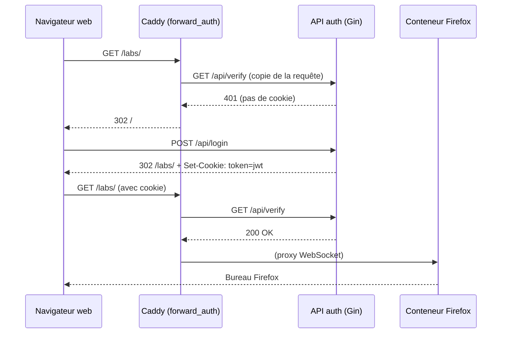

### 🦊 Firefox Remote GUI over Web (Docker + noVNC + Caddy)

Ce projet permet de **lancer un navigateur Firefox dans un environnement graphique complet sur un VPS**, et d’y accéder **depuis un navigateur web** à l’adresse :

---

### 📦 Contenu du projet

- **Docker Compose** : orchestration automatique des services
- **Container XFCE + Firefox + VNC + noVNC** :
  - XFCE = environnement de bureau léger
  - Firefox = navigateur utilisable
  - VNC = serveur de bureau distant
  - noVNC = client HTML5 dans le navigateur
- **Caddy** : reverse proxy HTTP sur le port 6667

---

### 🧠 Définitions

#### 🖥️ VNC (Virtual Network Computing)

Protocole qui permet de **voir et contrôler à distance un environnement graphique** (bureau Linux). Il fonctionne généralement via un port TCP comme 5901.

#### 🌍 noVNC

Un **client VNC en HTML5**. Il permet de **se connecter au serveur VNC via un navigateur web**, sans logiciel natif.

Il utilise un **WebSocket (```ws://``` ou ```wss://```)** pour convertir le flux VNC en flux web interactif via un proxy nommé ```websockify```.

#### 🧰 Caddy

Un serveur web et reverse proxy qui :

- Sert l’interface web à l’URL ```http://<IP>:6667```  
- Redirige le trafic vers le conteneur Firefox/noVNC  
- Peut gérer automatiquement le HTTPS (non activé ici, mais prévu facilement)  

---

## 📂 Contenu du dépôt

| Service              | Rôle                                                                                 | Port interne |
|----------------------|--------------------------------------------------------------------------------------|--------------|
| **navigateur**       | Ubuntu + Firefox + VNC + noVNC (WebSocket)                                            | 80           |
| **auth**             | API Gin + page de login HTML, émet un JWT et le stocke dans un cookie ```HttpOnly``` | 8081         |
| **caddy**            | Reverse-proxy / HTTPS automatique / Auth ```forward_auth``` / WebSocket pass-through  | 443 (TLS)    |

> Les ports VNC (5900+) et websockify (6080) restent **privés** – seule la sortie HTTPS est exposée.

---

## 🚀 Démarrage rapide

```bash
# 1) variables d’environnement – à adapter
export LOGIN_USER=alice
export LOGIN_PASS=supersecret
export JWT_SECRET=$(openssl rand -hex 32)   # 64 caractères aléatoires

# 2) build & run
docker compose up -d
```

### Connexion

1. Ouvre ```https://votre-domaine/``` → Page de login  
2. Entre **LOGIN_USER / LOGIN_PASS** → redirection vers **```/labs/```**  
3. Caddy propage les WebSockets → interface Firefox dans le navigateur 🎉  

### Déconnexion

- Appelle **```https://votre-domaine/dc```** (ou ajoute un bouton « Déconnexion » pointant sur ```/dc```).  
- Le cookie ```token``` est supprimé, tu es renvoyé sur ```/```.

---

## 🛡️ Flux d’authentification



---

## ⚙️ Variables d’environnement

| Variable   | Par défaut | Description                                                    |
|------------|-----------|----------------------------------------------------------------|
| LOGIN_USER | —         | Nom d’utilisateur accepté                                      |
| LOGIN_PASS | —         | Mot de passe                                                   |
| JWT_SECRET | —         | Clé HMAC-SHA256 pour signer le JWT                             |

---

## 🔒 Sécuriser encore plus

```bash
# Pare-feu
sudo apt install ufw -y
sudo ufw allow 22/tcp       # SSH
sudo ufw allow 80,443/tcp   # HTTP + HTTPS
sudo ufw enable
```

### ✅ Prochaines étapes possibles

- Crypter le flux par dessus le TLS
- Frontend
