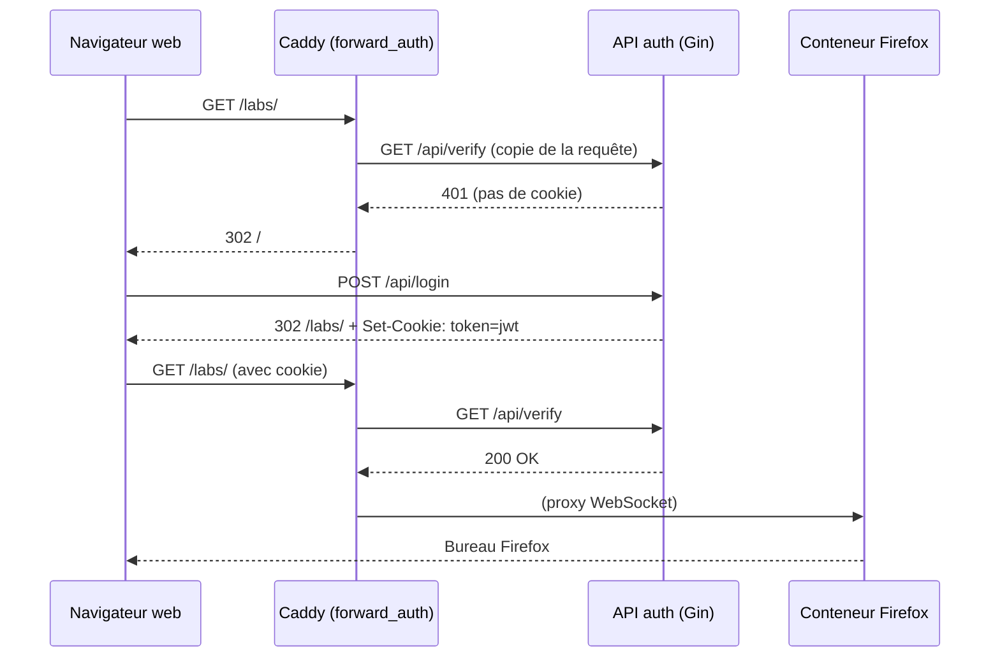

# 🦊 Firefox Remote GUI over Web (Docker + noVNC + Caddy)

Exécutez un navigateur **Firefox** dans un environnement graphique complet directement sur votre VPS ; accédez‑y ensuite depuis **n’importe quel navigateur web** — sans installer de client VNC natif.

---

## 📑 Sommaire

- [V1](#v1)  
  1. [Présentation](#1-présentation)  
  2. [Fonctionnalités principales](#2-fonctionnalités-principales)  
  3. [Définitions](#3-définitions)  
  4. [Contenu du dépôt](#4-contenu-du-dépôt)  
  5. [Démarrage rapide](#5-démarrage-rapide)  
  6. [Connexion & Déconnexion](#6-connexion--déconnexion)  
  7. [Flux d’authentification](#7-flux-dauthentification)  
  8. [Variables d’environnement](#8-variables-denvironnement)  
  9. [Sécurisation supplémentaire](#9-sécurisation-supplémentaire)  
- [V2](#v2)  
  10. [Cloudflare Tunnel – Publication sécurisée](#10-cloudflare-tunnel--publication-sécurisée)  
  11. [Prochaines étapes](#11-prochaines-étapes)
  
---
## V1

### 1. Présentation

Ce dépôt fournit tout le nécessaire (Docker Compose, images prêtes à l’emploi et reverse‑proxy) pour lancer une session graphique **XFCE + Firefox** à distance ; l’interface VNC est encapsulée dans **noVNC** puis exposée en HTTPS via **Caddy**. Résultat : un « Firefox dans le cloud » accessible à l’URL de votre serveur.

---

### 2. Fonctionnalités principales

| Composant | Rôle |
|-----------|------|
| **Docker Compose** | Orchestration et mise en réseau automatique des conteneurs |
| **Conteneur XFCE / Firefox / VNC / noVNC** | • XFCE : environnement de bureau léger<br>• Firefox : navigateur intégré<br>• VNC : partage du bureau<br>• noVNC : client HTML5 côté navigateur |
| **Caddy (Reverse‑Proxy)** | • Sert l’interface web (<code>https://votre‑domaine</code>)<br>• Gère le TLS automatique (LetsEncrypt)<br>• Passe les WebSockets (VNC) & applique l’authentification |

---

### 3. Définitions

#### 🖥️ VNC (Virtual Network Computing)
Protocole permettant de **voir et contrôler** un bureau distant. Fonctionne généralement sur le port **5901** (TCP).

#### 🌍 noVNC
Client VNC **100 % HTML5**. Convertit le flux VNC en WebSocket (via **Websockify**) pour une utilisation directe dans un navigateur.

#### 🧰 Caddy
Serveur web / reverse‑proxy moderne qui :

* sert l’interface à <code>https://votre‑domaine</code> ;
* propage les WebSockets vers le conteneur Firefox ;
* peut gérer automatiquement les certificats TLS (activé par défaut).

---

### 4. Contenu du dépôt

| Service | Description | Port interne |
|---------|-------------|--------------|
| **navigateur** | Ubuntu + Firefox + VNC + noVNC | 80 |
| **auth** | API Gin + page de login, émet un JWT stocké en cookie <code>HttpOnly</code> | 8081 |
| **caddy** | Reverse‑proxy, TLS auto, <code>forward_auth</code>, WebSocket pass‑through | 443 |

> Les ports VNC (5900+) et Websockify (6080) restent **privés** : seule la sortie HTTPS est exposée.

---

### 5. Démarrage rapide

```bash
# 1) Variables d’environnement (à adapter)
export LOGIN_USER="alice"
export LOGIN_PASS="supersecret"
export JWT_SECRET=$(openssl rand -hex 32)   # 64 caractères aléatoires

# 2) Build & run
docker compose up -d
```

---

### 6. Connexion & Déconnexion

1. Ouvrez <code>https://votre‑domaine</code> → page de login.
2. Saisissez **LOGIN_USER / LOGIN_PASS** → redirection vers <code>/labs/</code>.
3. Caddy propage les WebSockets → l’interface Firefox apparaît dans votre navigateur 🎉.

**Se déconnecter** : appelez <code>https://votre‑domaine/dc</code> (ou créez un bouton). Le cookie <code>token</code> est supprimé puis redirection vers <code>/</code>.

---

### 7. Flux d’authentification



---

### 8. Variables d’environnement

| Variable | Par défaut | Description |
|----------|------------|-------------|
| `LOGIN_USER` | — | Nom d’utilisateur autorisé |
| `LOGIN_PASS` | — | Mot de passe correspondant |
| `JWT_SECRET` | — | Clé HMAC‑SHA256 pour signer les tokens JWT |

---

### 9. Sécurisation supplémentaire

```bash
# Pare‑feu UFW
sudo apt install ufw -y
sudo ufw allow 22/tcp       # SSH
sudo ufw allow 80,443/tcp   # HTTP + HTTPS
sudo ufw enable
```

---

## V2

### 10. Cloudflare Tunnel – Publication sécurisée

Depuis la V2, le service n’expose **plus aucun port public** : tout transite par un **Cloudflare Tunnel** managé automatiquement.

1. **Bootstrap (conteneur `cf-bootstrap`)** : à chaque `docker compose up`, un script Shell :
   * récupère ou crée le tunnel « auto‑tunnel » via l’API Cloudflare ;
   * télécharge le *run‑token*, prépare `config.yml` ;
   * crée/actualise un record **CNAME proxifié** (<code>zos‑academy.fr → &lt;tunnel-id&gt;.cfargotunnel.com</code>).
2. **cloudflared** monte ensuite le tunnel ; 4 connexions QUIC sont établies vers les POPs les plus proches (Paris : *cdg0x*).
3. Le trafic HTTPS public frappe Cloudflare ➜ est routé via le tunnel ➜ atteint **Caddy** en HTTP clair (port 80) ➜ passe l’auth `forward_auth` ➜ est proxifié vers noVNC.

**Avantages** :

| 🔒 Sécurité | 🚀 Simplicité | 💰 Coût |
|-------------|--------------|---------|
| Aucun port ouvert sur le VPS<br>Mitigation DDoS / WAF optionnels | Pas de DNS A/AAAA à gérer, certif TLS auto côté edge | Gratuit jusqu’à 100 tunnels et 100 000 requêtes/jour |

---

### 11. Prochaines étapes

* Crypter les call + websocket en plus du TLS via une cle partager entre le front et le back
* Rajouter un Front de connection
* Ajouter des headers de sécurité CSP/COEP dans Caddy.
* Activer le mode **Zero‑Trust Access** (JWT Cloudflare) au lieu de l’auth locale.
* Publier l’image *navigateur* sur Docker Hub.
* CI/CD : build & lint Go + tests e2e (Playwright).
* Documentation EN + FR.
